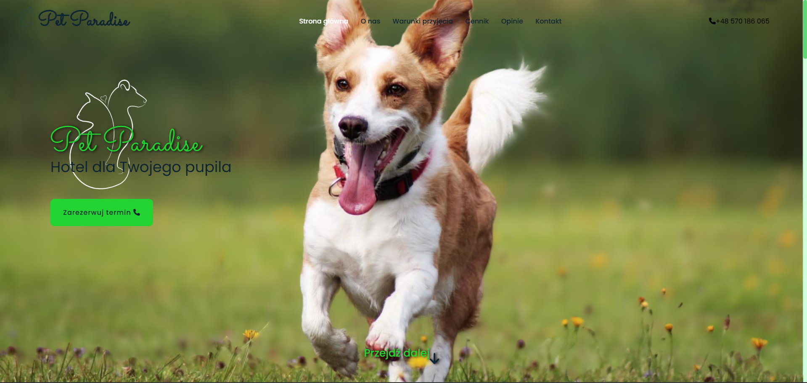
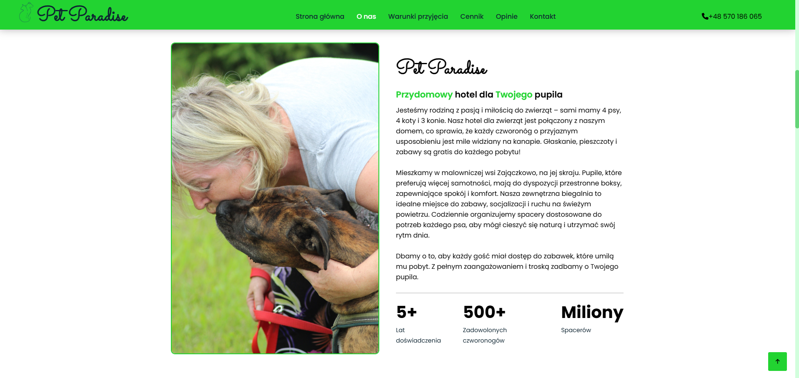
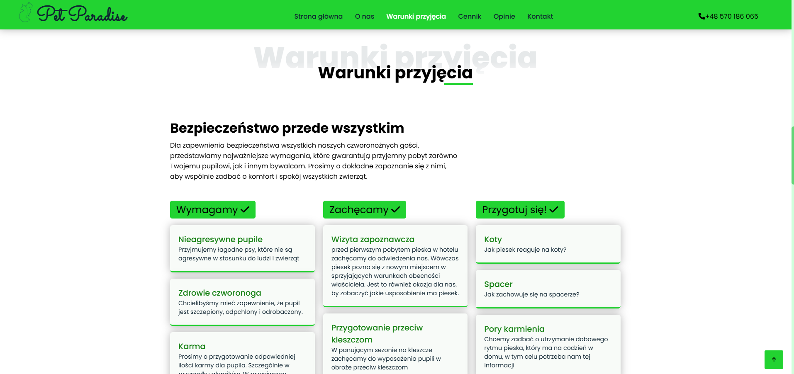
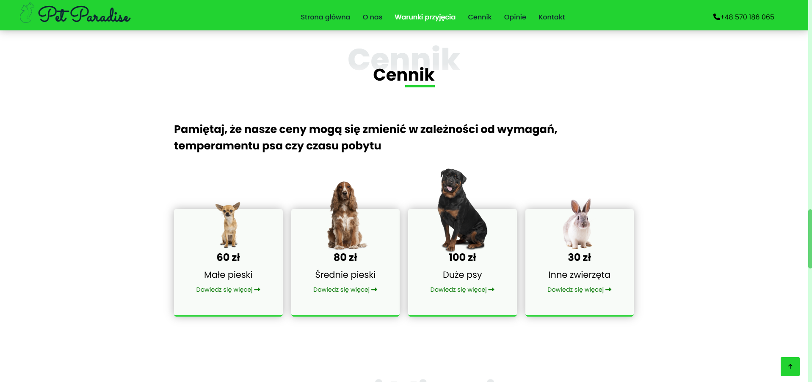
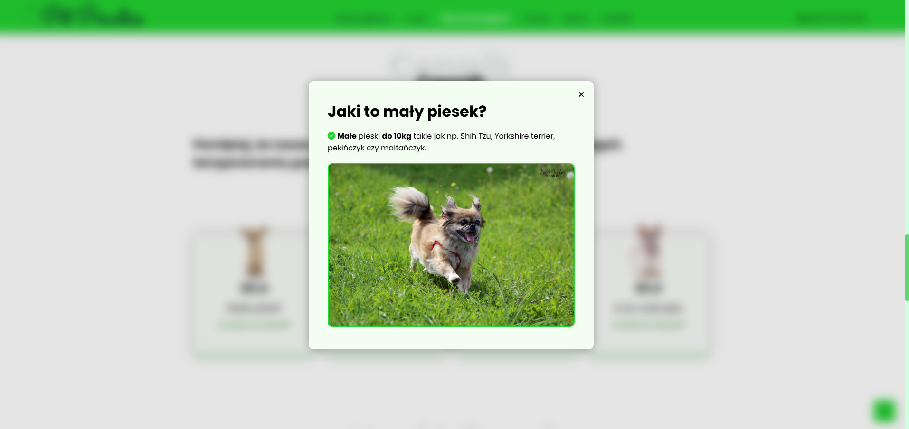
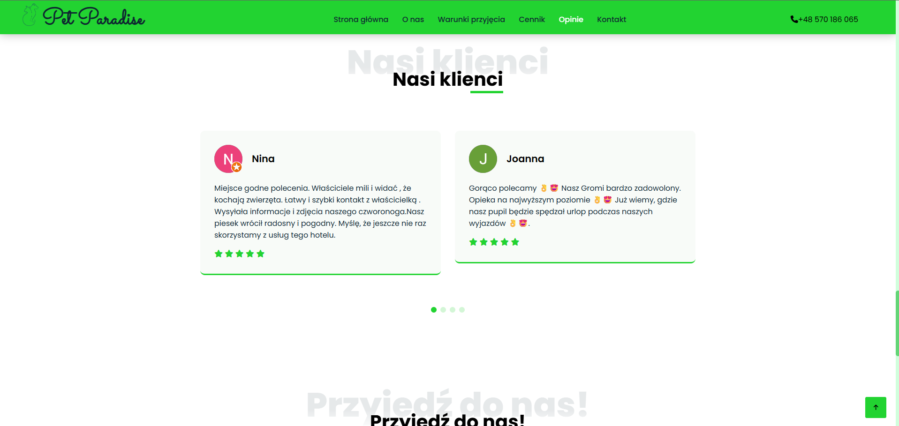
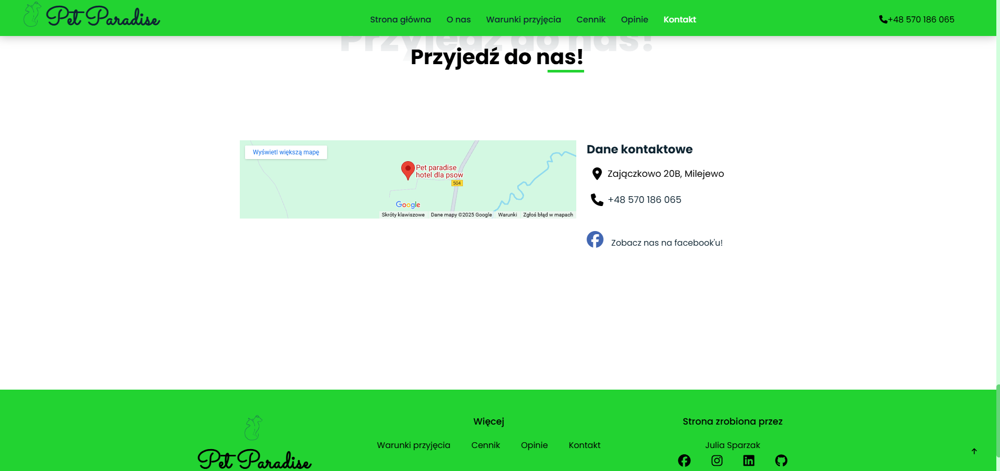

https://imsayvi.github.io/PetParadise/

PetParadise to strona wizytówka dla psiego hotelu zlokalizowanego w małej wiosce Zajączkowo na północy Polski.

Strona została stworzona w czystym HTML, CSS i JavaScript, z wykorzystaniem kilku zewnętrznych bibliotek i frameworków, takich jak Swiper, jQuery, Font Awesome, Waypoints oraz Owl Carousel, co zapewnia nowoczesną i responsywną funkcjonalność.

Projekt zawiera przygotowanego PHPMailer’a do obsługi formularza kontaktowego, jednak na chwilę obecną nie jest on aktywnie używany.

Na stronie znajdują się wszystkie podstawowe informacje, które powinny znaleźć się na witrynie tego typu: cennik, opinie klientów, lokalizacja, opis usług, formularz kontaktowy oraz warunki korzystania.

_____________________________________________________________

PetParadise is a showcase website for a dog hotel located in the small village of Zajączkowo in northern Poland.

The website is built with pure HTML, CSS, and JavaScript, leveraging several external libraries and frameworks such as Swiper, jQuery, Font Awesome, Waypoints, and Owl Carousel to provide modern and responsive functionality.

The project includes a prepared PHPMailer setup for handling the contact form, although it is currently not in active use.

The site contains all the essential information typically expected on this type of website: pricing, customer reviews, location, service description, contact form, and terms of service.

